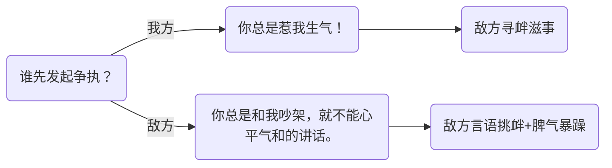
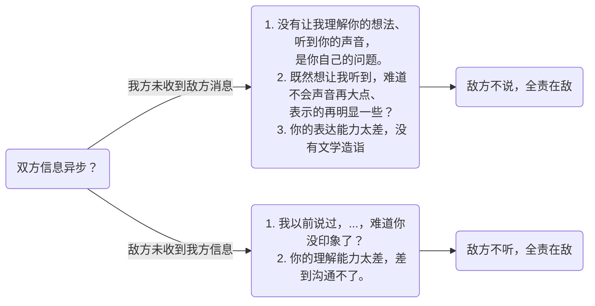
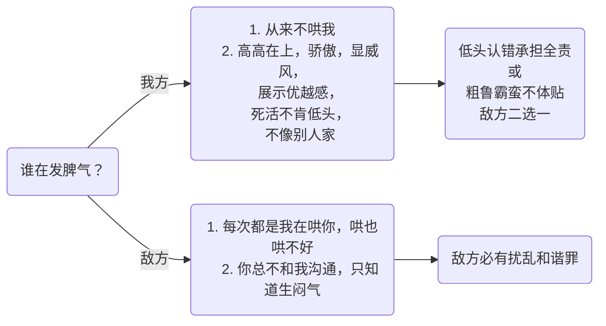
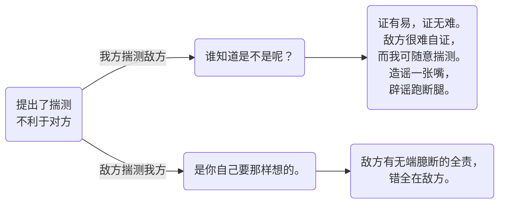
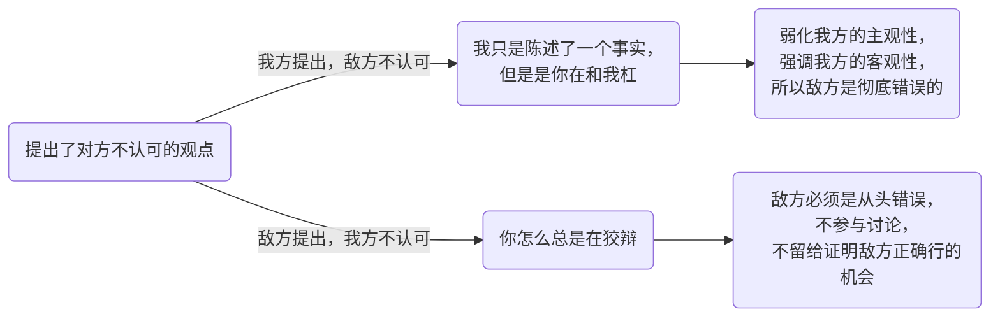
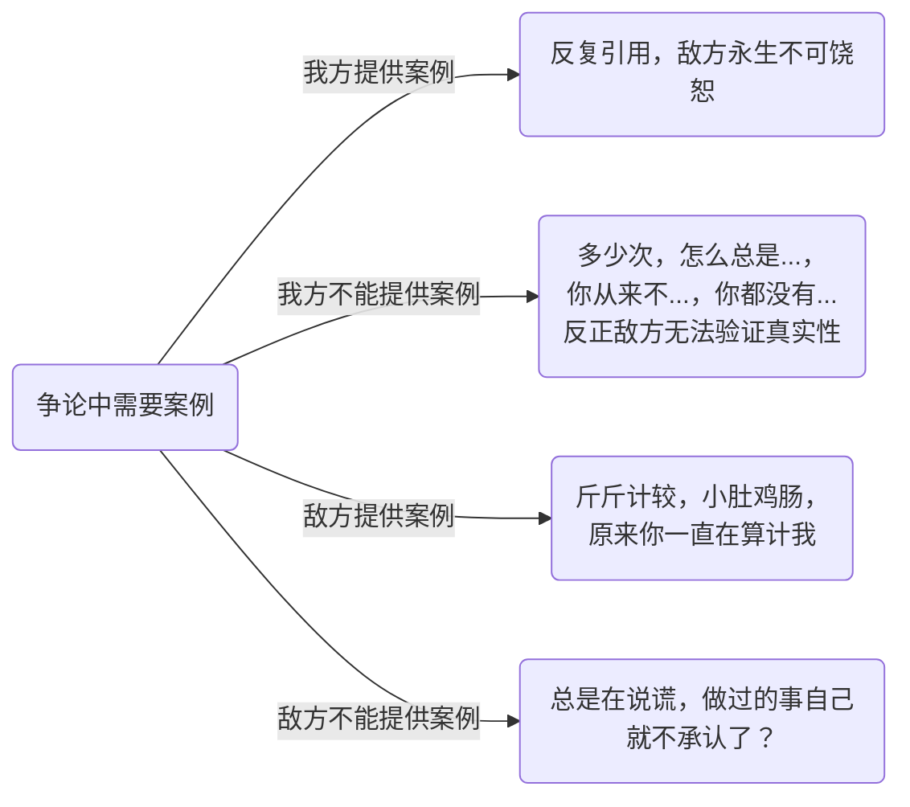
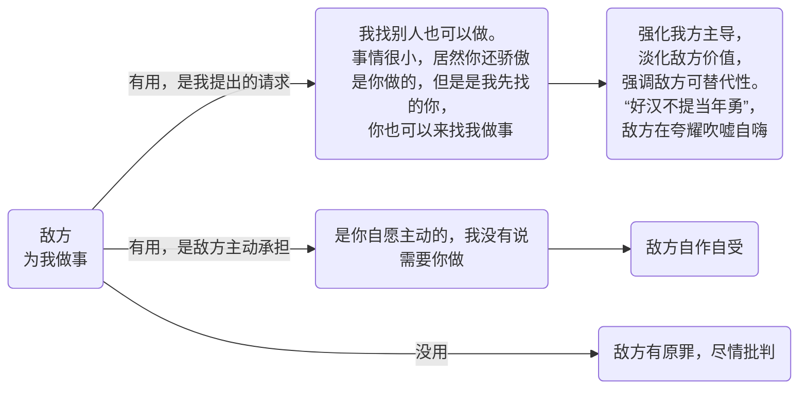
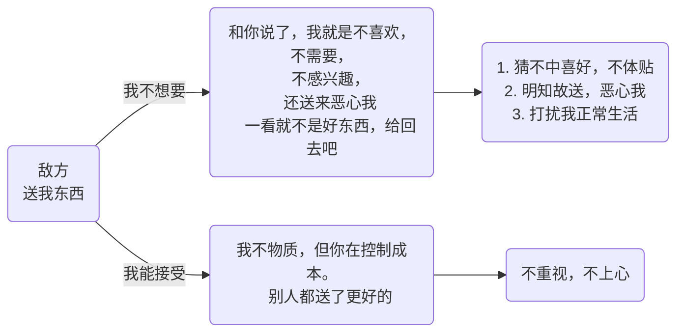

#  推诿技战法

不论什么场景、什么事件，总有一款“罪名”适合“敌人”，永葆自己一世清白。

`总体原则：给敌方定罪。只要能给敌方定罪并强调之，就可以减少或避免对于我方行为的讨论。`

## 1. 引起争执

## 2. 沟通不畅

## 3. 发脾气

## 4. 不利于对方的揣测

## 4. 不同观点

## 5. 提供证据

## 6. 敌方为我做事

## 7. 敌方送我东西

一定不能说“谢”，不然会体现出似乎已经接受的态度，而没有用的东西绝对不能收，自己喜欢与否No. 1

## 8. 拒绝敌方

1. 我就是不想...，你就是在强迫我
2. 不要妨碍我...
3. 只有你们才这样
4. 你可以休息了，我还要加班
5. 我已经给过你选择了，我给你机会了
6. 我们两清，我给你转账

